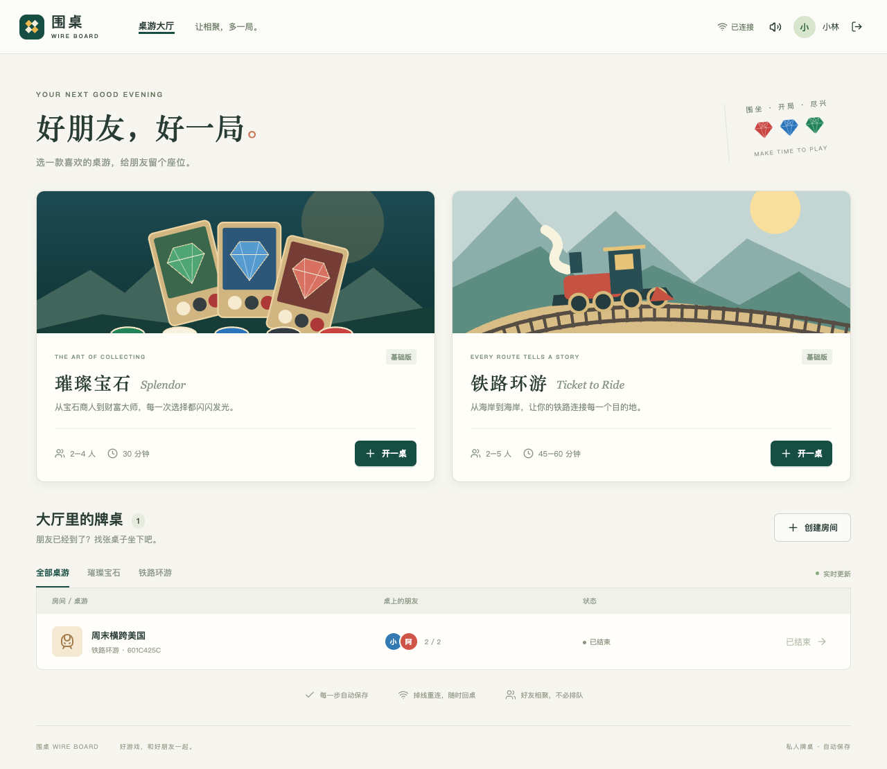

# 围桌 · Wire Board

为朋友小圈子搭建的中文桌游大厅：邀请码注册、登录、大厅、带密码的房间、准备与开局、实时联机、自动保存、断线重连、结算与再来一局。

- **璀璨宝石 Splendor 基础版**：2–4 人，90 张发展卡、10 位贵族；拿取、预留、黄金、折扣、弃置、贵族选择、完整最后一轮及同分判定。
- **铁路环游 Ticket to Ride 美国基础版**：2–5 人，36 城市、100 路线、30 目的地、110 列车牌；公开万能牌限制、自动换市场、双线限制、任务选择、最后一轮、最长路线与完整计分。
- **卡坦岛 CATAN 基础版**：3–4 人，随机岛屿、蛇形起始建设、资源生产、强盗与同时弃牌、港口和玩家交易、五种发展卡、最长道路和最大骑士军队，自己的回合达到 10 分获胜。支持电脑玩家、观战与私人手牌。
- **卡卡颂 Carcassonne 基础版**：2–5 人，72 张地块、每人 7 名随从；地块旋转预览与确认、道路/城市/修道院/农民、区域占领与多数判定、完整终局计分。地图可拖动、滚轮缩放和适配全图，支持电脑玩家与观战，不含扩展。
- **支持单人体验**：房主在等待房间添加电脑玩家，自己准备后即可开局；可与朋友和多名电脑混合游玩，开局前可移除电脑。基础 AI 在服务端自动行动，无需外部模型、API 或额外配置。
- **观战**：大厅可观看进行中的对局，不占玩家座位；密码房间需要密码。进行中隐藏手牌、预留卡和目的地等私人信息，可查看公开日志、在聊天中发言并标注「观战」，随时退出。
- **玩家与战绩**：点击真人昵称查看个人资料、四款游戏的战绩与分页历史；自己的页面可搜索玩家、申请好友、接受或移除好友。电脑不提供资料入口。大厅只显示全部等待中或进行中的房间，结束后移入个人历史；已结束对局不能新加入观战。
- **牌桌聊天**：右下角浮动聊天框，仅当前牌桌成员可见，带未读提示；最多保留最近 100 条，每条 500 字，刷新和服务重启后仍可查看。聊天不会重置回合或打断选牌。
- **Go + React/TypeScript + SQLite + WebSocket**。前端嵌入 Go 程序，单实例，无 Redis、外部数据库；美术素材可通过自有 CDN 加载。游戏规则和隐藏信息由服务器管理。
- 原版资源配色、暖白与深绿大厅、标准底图上的可缩放中文铁路地图。声音由浏览器本地合成，可静音。电脑、平板优先；地图支持滚轮以鼠标位置缩放、手型拖动和城市名开关，窄屏可触摸滑动；目的地任务可收起查看地图，完成进度仅本人可见。后台轮到自己时，标签页标题交替提醒。

## 界面预览



[璀璨宝石桌面](docs/screenshots/splendor.png) · [铁路环游桌面](docs/screenshots/rail.png) · [窄屏示例](docs/screenshots/rail-mobile.png) · [验证记录](docs/verification.md)

## Linux amd64 部署

GitHub Actions 自动产出 Linux amd64 压缩包、校验和与 `ghcr.io/k0ngk0ng/wire-board` 容器镜像。每次 main push 会测试并发布镜像；`v*` 标签另外创建 GitHub Release。它不自动登录或修改你的服务器。

### 方式一：单个可执行文件

从 [Releases](https://github.com/k0ngk0ng/wire-board/releases) 下载 `wire-board-linux-amd64.tar.gz` 和 `SHA256SUMS`。仓库为私有时，需要登录有权限的 GitHub 账号；也可以在 Actions 对应运行页下载同名构建产物。

```sh
sha256sum -c SHA256SUMS
mkdir -p wire-board && tar -xzf wire-board-linux-amd64.tar.gz -C wire-board
cd wire-board
cp .env.example .env
# 编辑 .env，至少修改 INVITE_CODE
set -a
. ./.env
set +a
export ADDR=127.0.0.1:8080
export DATA_DIR="$PWD/data"
./wire-board
```

Go 二进制静态编译，不需要服务器安装 Go、Node 或 SQLite。首次运行自动创建数据库。内网直接访问可将 `ADDR=:8080`，并按网络需求开放端口。公网域名部署应配置 HTTPS，设置 `PUBLIC_ORIGIN=https://你的域名` 与 `COOKIE_SECURE=true`。`.env` 由 shell 或 Compose 加载，程序本身不读取 `.env` 文件。

建议用 systemd 管理长期进程，示例见 [部署说明](docs/deployment.md)。

### 方式二：Docker Compose

把 `compose.yaml`、`.env.example` 和 `scripts/update.sh` 放到服务器同一目录（Release 压缩包已包含这些文件）。公开镜像无需 GitHub 登录：

```sh
cp .env.example .env
# 编辑 .env，至少修改 INVITE_CODE；内网直连设置 BIND_ADDRESS=0.0.0.0
chmod 600 .env
chmod +x update.sh
sudo ./update.sh
docker compose logs -f
```

默认只监听 `127.0.0.1:8080`，适合接入服务器已有反向代理。SQLite 存在 `board-data` 命名卷；更新镜像不清空账号和对局。不要执行 `docker compose down -v`，这会删除数据卷。单局中断可以刷新或重新登录恢复；房主可以主动结束未完成牌桌。

以后在部署目录执行 `sudo ./update.sh` 更新，或 `sudo ./update.sh v1.1.1` 指定版本。脚本固定从 GHCR 拉取镜像，先下载、在线备份并校验压缩，最后才短暂切换容器；健康检查失败会尝试恢复旧镜像。Nginx、Certbot 和备份说明见 [部署说明](docs/deployment.md)。服务器地址、域名、邀请码和凭据仅保存在服务器配置中，不要提交到仓库。

运行 `sudo ./update.sh clean` 清理本项目旧镜像，保留当前部署、上一版回滚镜像及所有容器使用中的镜像；不清理其他服务、数据卷或备份。

## 环境变量

| 变量 | 默认值 | 含义 |
| --- | --- | --- |
| `INVITE_CODE` | 无，必须设置 | 注册邀请码；修改后已有账号不受影响 |
| `ADDR` | `:8080` | Go 监听地址，Compose 固定容器端口 8080 |
| `DATA_DIR` | `data` | 数据目录，容器中为 `/data` |
| `PUBLIC_ORIGIN` | 空 | 允许的源地址，例如 `https://board.example.com`，不带末尾斜杠 |
| `ASSETS_BASE_URL` | 空 | 可选 HTTPS 素材目录；配置与上传见 [素材部署](docs/assets.md) |
| `COOKIE_SECURE` | `false` | HTTPS 部署应设为 `true` |
| `BIND_ADDRESS` | `127.0.0.1` | 仅 Compose：宿主机绑定地址 |
| `PORT` | `8080` | 仅 Compose：宿主机端口 |

健康检查：`GET /healthz`。反向代理必须支持 `/api/ws` 的 WebSocket Upgrade，并保留原始 Host。示例见 [部署说明](docs/deployment.md)。

## 本地开发与验证

需要 Go 1.26+、Node 22+。以下命令从仓库根目录执行，缓存和临时文件均存放在仓库 `.local` 中。

```sh
. scripts/env.sh
npm --prefix web ci
npm --prefix web run build

go test -race -count=1 -timeout=10m ./...
go vet ./...
go build -o .local/wire-board .
INVITE_CODE=local-friends ADDR=127.0.0.1:18080 DATA_DIR="$PWD/.local/data" .local/wire-board
```

前端开发：将后端监听 `127.0.0.1:8080`，运行 `npm --prefix web run dev`，通过 Vite 开发地址访问。第一次运行 Go 前需要先构建前端以满足 embed。

测试覆盖规则边界、资源守恒、完整 2/4 人璀璨宝石、2/5 人铁路与 3/4 人卡坦岛对局、最长路线中的循环、隐藏信息、身份认证、CSRF、房间密码、并发和幂等、WebSocket 通知、重启恢复与结算后离桌。

## 设计与约定

- 房主开始前，所有真人必须准备；电脑自动准备。璀璨宝石与铁路至少两个座位、卡坦岛至少三个座位（含电脑），不必坐满。第一位座位先行动。
- 电脑玩家使用基础启发式策略，只依据公开牌面和自己的手牌、任务选择行动。每步间隔约 1–2 秒，行动照常持久化；刷新或服务重启后继续。电脑不会自动移出超时真人。房主移交给真人；最后一位真人离桌后清除电脑空房间。
- 每回合 120 秒，倒计时持久化；超时后其他同局玩家可移出当前玩家，剩余玩家继续，最后一人获胜。未被移出前仍可操作。房主可结束牌桌，此时不计胜负。
- 卡坦岛每组起始村庄与道路共用 120 秒，超时自动放置；掷出 7 后所有待弃牌玩家共用 120 秒，超时随机弃足数量，再给当前玩家新的 120 秒处理强盗。普通回合中的交易、建造、发展卡不重置时限。移出玩家的资源归还，建筑道路保留但不再生产。
- 铁路开局所有人同时选择目的地，120 秒后为未提交者保留前两张；普通回合内的第二次摸牌和任务选择、璀璨宝石弃牌和贵族选择均不重置计时。
- 移出玩家后，璀璨宝石筹码归还、预留卡洗回；铁路列车牌归还，已铺线路保留。离场玩家不参与排名。
- 服务器按用户生成视图，不向对手发送秘密手牌、预留卡或目的地；结束后公开铁路任务。客户端只提交动作，不能指定结果。
- 每次操作在 SQLite 事务中保存局面和审计动作；版本号拒绝过期操作，唯一操作编号保证重试不重复执行。重启后仍有效。
- 璀璨宝石默认优先支付对应颜色宝石，也可主动选择黄金替代，保留其他宝石；可盲预留牌堆顶牌。
- 铁路环游的极端枯竭处理：不足三张普通列车牌可供形成市场时保留有限牌面，避免无限洗牌；所有玩家均无合法行动时提前结算。这两项是保证线上对局不死锁的明确约定。
- 暂不包含 AI 难度选择、扩展包、排位、邮箱找回或多人同时登录不同身份的同浏览器标签页。可使用不同浏览器配置文件测试多用户。
- 单实例设计，SQLite 数据目录应放在本地磁盘，不支持多个服务实例共享同一数据库文件。

素材和数据来源见 [第三方声明](docs/THIRD_PARTY.md)。项目不连接 BGA 游戏服务；商业卡牌和地图由部署者单独配置，仓库和镜像不包含这些图片。

历史记录从本版本开始独立保存，不受离桌、删除房间或再来一局影响；升级时会收录服务器仍保留的已结束对局，先前已删除或被新一局覆盖的记录无法恢复。主动结束的牌桌仅在本人历史中显示，不计胜负。
